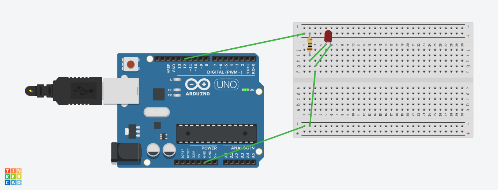
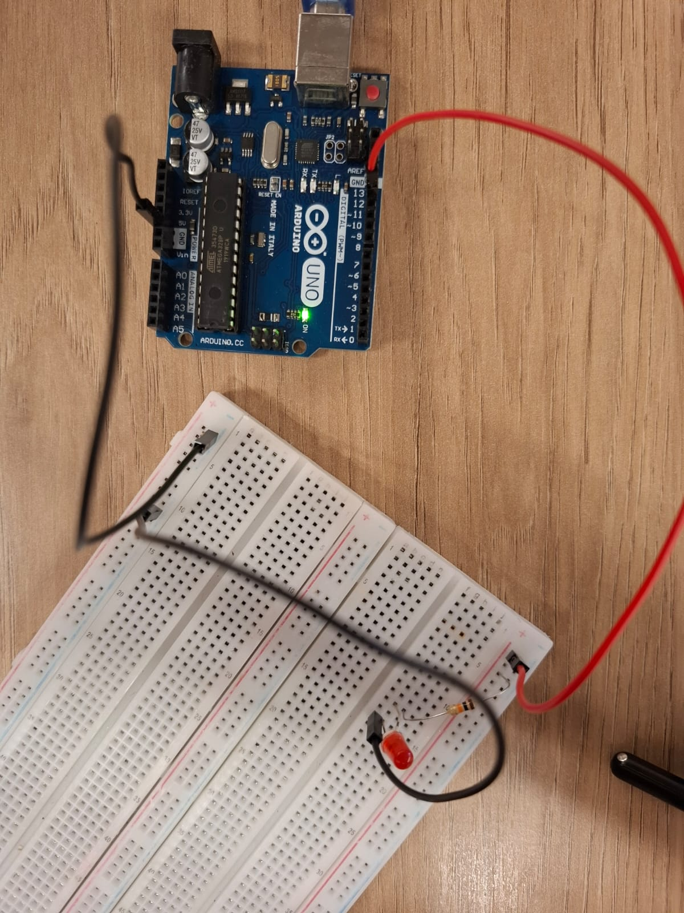

# blink_led

## Introdução

Este documento tem como objetivo descrever o que foi desenvolvido, como foi implementado, a estrutura de diretórios do projeto **blink_led** e sua conclusão. O projeto consiste em dois experimentos básicos utilizando **Arduino e C++**, cujo propósito é compreender o funcionamento de pinos digitais, o uso de comandos básicos da linguagem e conceitos simples de circuitos elétricos.

## O que foi feito 

O projeto tem dois objetivos principais:

1. Parte 1: Fazer o LED interno do Arduino piscar, aplicando conceitos básicos de programação em C++ e controle digital.  
2. Parte 2: Montar um circuito físico com um LED externo, controlado via código, unindo conhecimentos de eletrônica básica e programação em Arduino.

Essas duas etapas permitem entender tanto a lógica de controle via software quanto a montagem de hardware simples, como o uso de resistores e conexões em protoboard.

## Como foi feito

O projeto foi dividido em **duas partes** independentes:  

### Parte 1 — LED interno do Arduino

O código abaixo foi escrito e compilado diretamente na placa Arduino:

```c++
void setup() {
  // Configuração inicial: define o pino do LED interno como saída
  pinMode(LED_BUILTIN, OUTPUT);
}

void loop() {
  // Liga o LED interno
  digitalWrite(LED_BUILTIN, HIGH);
  delay(400);  // Espera 400 milissegundos
  
  // Desliga o LED interno
  digitalWrite(LED_BUILTIN, LOW);
  delay(300);  // Espera 300 milissegundos
}
```

O código acima usa os seguintes elementos: 

- LED_BUILTIN: Constante pré-definida do Arduino que se refere ao LED interno da placa, geralmente ligado ao pino 13.

- pinMode(pin, OUTPUT): Define o modo do pino como saída (permite enviar sinal elétrico).

- digitalWrite(pin, HIGH/LOW): Envia sinal alto (HIGH) para ligar o LED e baixo (LOW) para desligar.

- delay(ms): Pausa o programa pelo tempo definido em milissegundos.

- loop(): O loop infinito faz o LED piscar repetidamente, com 400 ms ligado e 300 ms desligado.

### Parte 2 - LED externo com circuito físico

Nesta etapa, foi montado o seguinte circuito elétrico, tanto em simulação no Tinkercad quanto na prática física:





Os circuitos acima utilizam: 1 LED vermelho, 1 resistor de 1000 ohms e 3 jumper's para que seja possível fechar o circuito.

O código utilizado foi o seguinte:

```c++
int led = 12;
void setup() {
  // put your setup code here, to run once:
  pinMode(LED_BUILTIN, OUTPUT);
  pinMode(led, OUTPUT);
}

void loop() {
  // put your main code here, to run repeatedly:
  digitalWrite(LED_BUILTIN, HIGH);
  digitalWrite(led, HIGH);
  delay(400);
  digitalWrite(LED_BUILTIN, LOW);
  digitalWrite(led, LOW);
  delay(300);
}
```

o código acima funciona da seguinte forma:

- led: Variável que armazena o número do pino digital onde o LED externo foi conectado.

- pinMode(led, OUTPUT): Define o pino do LED externo como saída,permitindo controlar a tensão enviada.

- digitalWrite() e delay(): Funcionam da mesma forma que na Parte 1, mas agora controlam dois LEDs ao mesmo tempo: o interno (LED_BUILTIN) e o externo (led).

## Estrutura de pastas

A estrutura do projeto foi organizada para separar claramente cada parte e seus respectivos arquivos e mídias:

```
📁 blink_led/
├── 📁 parte_1/
|       ├── 📁 assets/
|       |       ├── 📄 ide_c++.png
|       |       ├── 📄 arduino_ligado.mp4
|       |       └── 📄 led_ligado.jpg
|       └── 📄 codigo_parte1.ino
├── 📁 parte_2/
|       ├── 📁 assets/
|       |       ├── 📄 circuito_pratica.jpg
|       |       ├── 📄 video_funcionamnto.mp4
|       |       └── 📄 simulacao_TinkerCad.png
|       └── 📄 codigo_parte2.ino
└── 📄 README.md
```

## Observação:

O link para o TinkerCad será enviado pelo card da adalove uma vez que ele permite a alteração do projeto por terceiro o que é um risco para o que já foi feito.

## Conclusão

O projeto **blink_led** serviu como uma introdução prática ao uso do **Arduino e C++**, reforçando conceitos de:

- Controle de pinos digitais;  
- Temporização com `delay`;  
- Estrutura básica de programas Arduino (`setup()` e `loop()`);  
- Montagem de circuitos simples com LED e resistor.

Esses fundamentos são essenciais para projetos mais complexos envolvendo sensores, atuadores e controle eletrônico.
